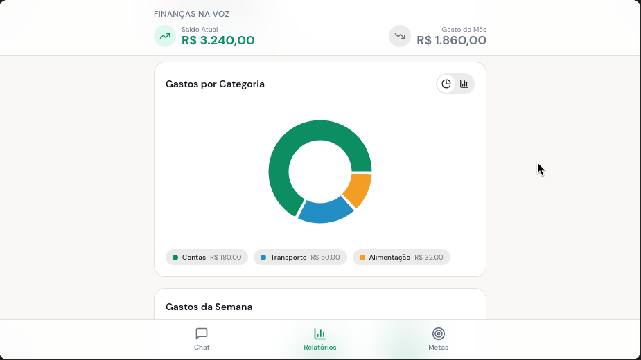
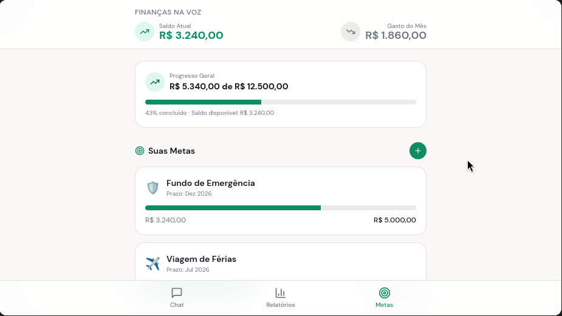

# 🎙️💸 Finanças na Voz - Desafio DIO

🔗 **Acesse o protótipo funcional aqui:** [finanas-na-voz.lovable.app](https://finanas-na-voz.lovable.app)

Este repositório contém a documentação e o processo de criação do MVP "Finanças na Voz", um projeto prático desenvolvido para exercitar o conceito de Vibe Coding e a estruturação de Prompts (PRD).

## 📱 Sobre o Aplicativo (O Pitch)
**O Problema:** O controle financeiro tradicional é burocrático. Usuários desistem de anotar seus gastos porque o processo de abrir um app, navegar por menus, selecionar categorias e digitar valores consome tempo e energia.
**A Solução:** Uma interface de chat fluida. Você simplesmente digita ou fala "Gastei 50 no almoço" e o nosso Agente Financeiro inteligente extrai o valor, categoriza a despesa e atualiza seu dashboard em tempo real.
**O Impacto:** Maior engajamento do usuário, retenção de longo prazo e democratização da educação financeira através de uma experiência sem fricção.

**Público-Alvo:** Pessoas que desejam organizar as finanças de forma prática e iniciantes que buscam uma porta de entrada amigável para o controle de gastos.

**Stack Tecnológica (MVP):** React, Tailwind CSS, Lucide Icons, Framer Motion, Recharts e lógica de extração simulada (NLP) via Vibe Coding no Lovable.

---

## 📄 Prompt Final (PRD - Product Requirements Document)

Abaixo está o documento base (PRD) utilizado para guiar a Inteligência Artificial na construção do escopo do aplicativo:

**Contexto:** Criar um aplicativo de Organização de Finanças Pessoais via chat em linguagem natural.
**Problema:** Alta desistência no controle de gastos devido à entrada manual e formulários complexos.
**Público-Alvo:** Iniciantes que buscam praticidade.

**Funcionalidades-Chave:**
1. Registrar gastos via chat em linguagem natural.
2. Classificar automaticamente as transações.
3. Definir e acompanhar metas financeiras.
4. Receber dicas de economia do “Agente Financeiro”.
5. Visualizar relatórios simples e personalizados.

---

## 📸 Demonstração e Interações com a IA

> **Nota:** Abaixo estão os registros visuais de como a IA interpretou os comandos e gerou a interface do aplicativo.

### 1. Interface Inicial (Dashboard e Chat)
A estrutura "mobile-first" gerada pelo primeiro prompt, com o dashboard fixo no topo e a área de chat pronta para interação.

### 2. Registro de Gasto via Linguagem Natural
O usuário digita uma frase simples e a lógica simulada extrai o valor e a categoria, gerando um card de confirmação.

### 3. Dashboard Atualizado Dinamicamente
Após a confirmação da transação no chat, o estado do React é atualizado e os gráficos e cards refletem o novo valor automaticamente.

---

## 🧠 Reflexão sobre o Processo

### O que funcionou bem?
* **A abordagem em camadas (Vibe Coding real):** Separar a criação em etapas funcionou perfeitamente. Primeiro a IA gerou a interface estática com dados mockados. Depois, a lógica de NLP foi adicionada com sucesso. Isso evitou alucinações da IA.
* **Implementação de features complexas:** Quando enviei o contexto do PRD, a IA conseguiu implementar navegação inferior (bottom nav), gráficos (Recharts) e sistema de metas de uma só vez, conectando tudo de forma lógica.
* **Refinamento estético:** Comandos curtos e
